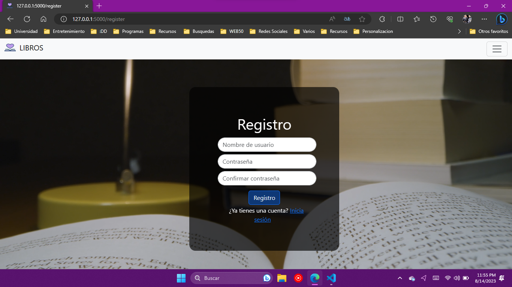
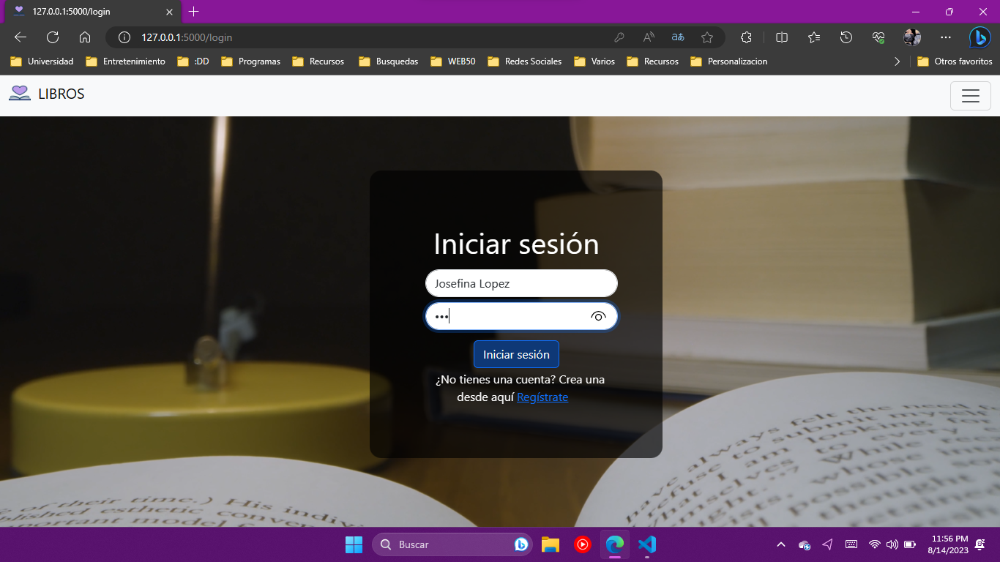
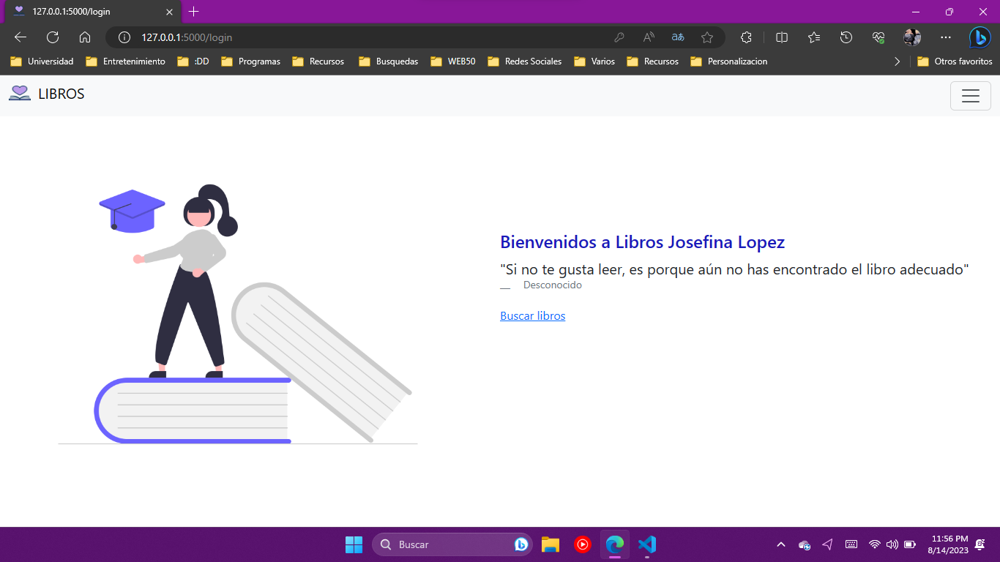
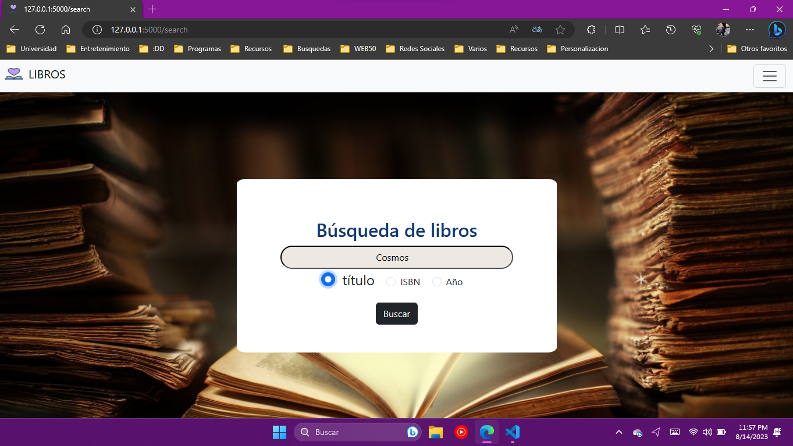
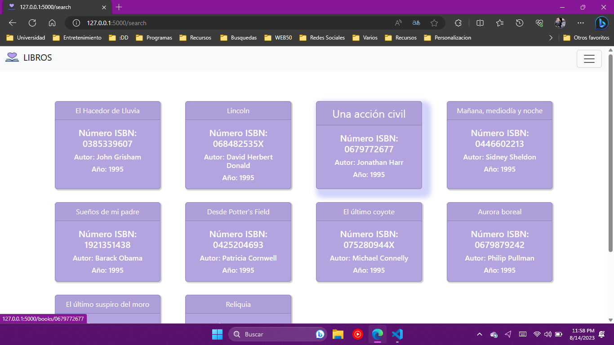
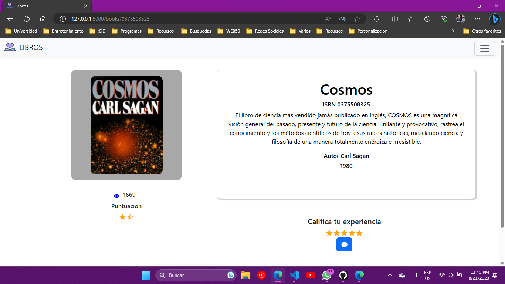
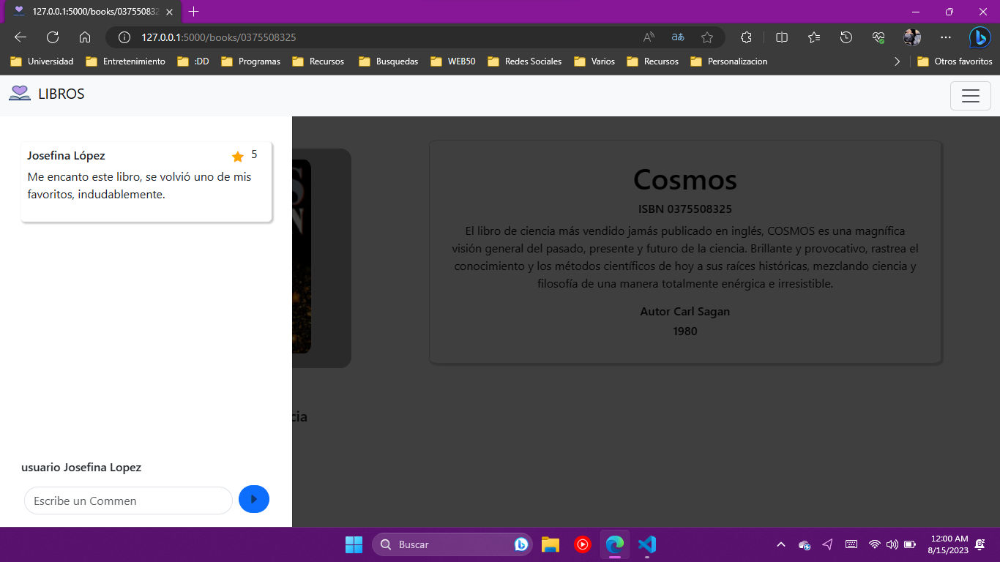
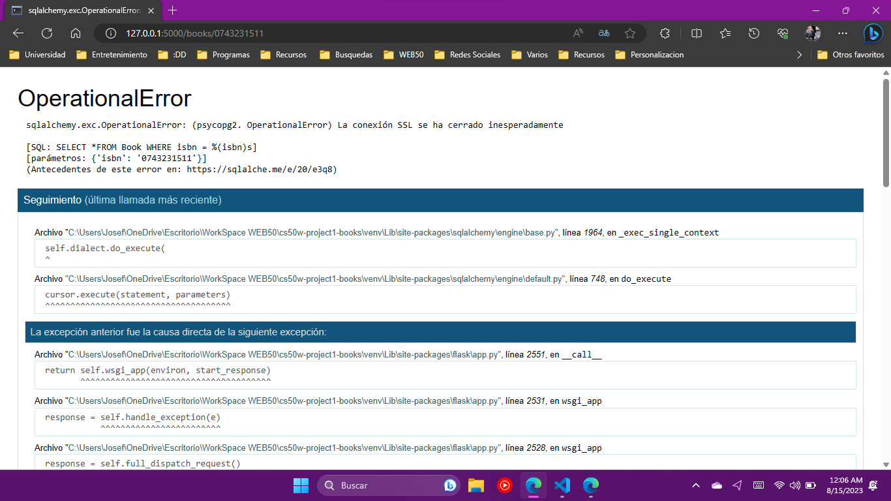

# Project1 - WEB50xNI - BOOKS 
Este proyect consiste en crear una pagina web dinamica o WebApp que utiliza la API de Google Books en conjunto
con los registros de cientos del libros almacenados en la base de datos, para poder cumplir los objetivos
del project y su principal funcionamiento, el cual consiste en ser una WebApp de reseñas de libros, en donde se podra,
interactuar con los registros y dar opiniones y calificaciones propias. 

El proyecto consta con 

## Una formulario de Registro de Usuarios 

## Un formulario de Inicio de Session 

## El index
 
## La pagina de Busquedas en la cual van 3 Opciones de Busquedas

## Pagina de Resultados con los primeros 10 resultados de la busqueda de libros.

## Pagina de Libros  
en esta se muestra una preve descripcion del libro, con su portada, 
estrellas, y unas para calificar, claro con su respectivo comentario el cual logicamente, solamente 
puede hacerse una vez.

### Nota 1
Debido a que la base de datos esta alojada en render y aveces la conexion es un poco inestable, 
si aparece este error, solamente recarga la pagina.

### Nota 2
Para probar La API  con los datos correspondientes, pedidos en los requisitos del proyect  ir a 
/api?isbn=0375508325

### Nota 3
Para ejecutar el programa solo ponga en consola 
> <Python application.py

